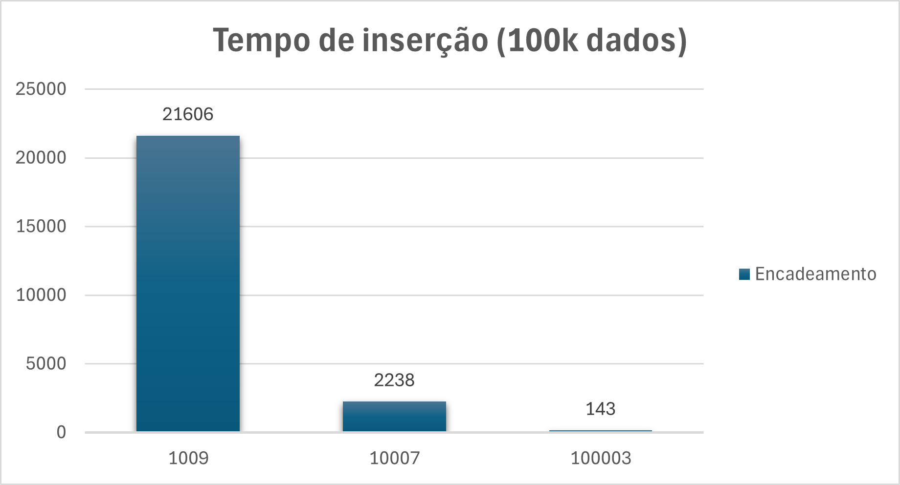
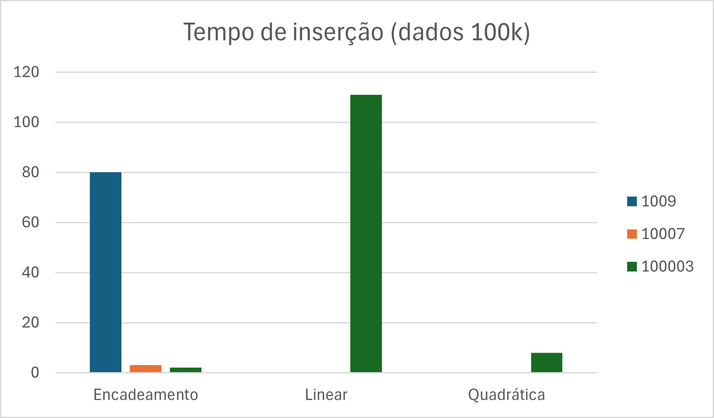
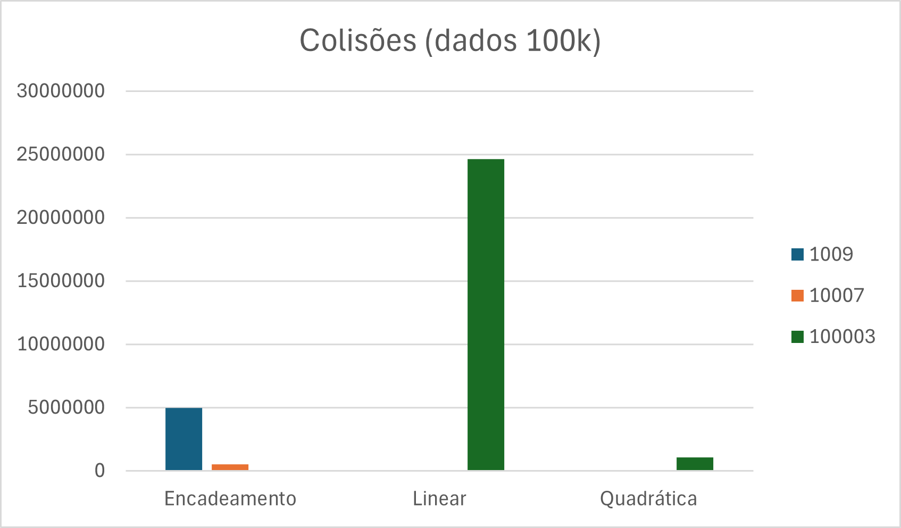

# Tabelas Hash em Java

## 1\. Introdução

Neste trabalho, foi realizada a implementação e a análise de desempenho de três diferentes abordagens para o tratamento de colisões em Tabelas Hash. O objetivo principal é comparar, na prática, a eficiência de cada método sob diferentes cenários de carga de dados e tamanho da tabela, medindo métricas como tempo de inserção, tempo de busca e número de colisões.

-----

## 2\. Metodologia e Implementação

Para a realização do experimento, foram adotadas as seguintes estratégias e parâmetros:

### Funções de Tratamento de Colisão Implementadas

Foram implementadas três classes distintas, cada uma representando uma técnica de tratamento de colisão:

1.  **Encadeamento Separado (`Encadeamento.java`):** Nesta técnica, as colisões são resolvidas através de listas ligadas. Todos os elementos que colidem em um mesmo índice do vetor são armazenados em uma lista naquela posição.
2.  **Sondagem Linear (`RehashingLinear.java`):** Uma técnica de endereçamento aberto onde, em caso de colisão, a próxima posição sequencial do vetor (`i+1`) é sondada até que um espaço livre seja encontrado.
3.  **Sondagem Quadrática (`RehashingQuadratica.java`):** Uma evolução da sondagem linear que, em caso de colisão, sonda o vetor com saltos quadráticos (`i*i`), visando mitigar o problema de agrupamento primário.

### Funções de Hash (h(chave))

Para garantir a originalidade do trabalho e não utilizar funções prontas dos slides, foram implementadas diferentes funções de hash para cada técnica:

* **Para o Encadeamento:** Foi utilizado o método da divisão (`chave % tamanho`), uma abordagem clássica e eficaz.
* **Para a Sondagem Linear:** Foi utilizada uma variação do método da divisão, multiplicando a chave por um número primo (31) para melhorar a distribuição dos dados (`Math.abs(chave * 31) % tamanho`).
* **Para a Sondagem Quadrática:** Foi implementado o **Método da Multiplicação**, utilizando a constante da razão áurea (A ≈ 0.618) para um espalhamento mais uniforme das chaves.

### Ambiente de Teste

O experimento foi conduzido sob os seguintes parâmetros fixos para garantir uma comparação justa e reprodutível:

* **Tamanhos de Tabela:** `{1009, 10007, 100003}` (valores primos para otimizar a performance).
* **Conjuntos de Dados:** `{100.000, 1.000.000, 10.000.000}` de registros.
* **Reprodutibilidade:** Foi utilizada uma `SEED` fixa para o gerador de números aleatórios, garantindo que os três métodos fossem testados com conjuntos de dados idênticos.

-----

## 3\. Resultados

Os resultados completos do experimento foram coletados e organizados. A seguir, apresentamos uma tabela consolidada e os gráficos mais relevantes que ilustram o desempenho de cada método.

### Tabela: Comparativo de Desempenho no Cenário de Estresse

*Condições: Tabela com 100.003 posições, inserindo 100.000 registros (Fator de Carga ≈ 99.9%)*

| Método | Tempo de Inserção (ms) | Tempo de Busca (ms) | Total de Colisões |
| :--- | :---: | :---: | ---: |
| **Encadeamento Separado** | 2 ms | 1 ms | 50.448 |
| **Sondagem Quadrática** | 8 ms | 17 ms | 1.053.465 |
| **Sondagem Linear** | 111 ms | 111 ms | 24.647.659 |

### Gráficos de Desempenho

**Gráfico 1: Tempo de Inserção em encadeamento**

**Gráfico 2: Tempo de inserção para os 3 tipos**

**Gráfico 3: Colisões para os 3 tipos**

-----

### Tabela: Dados Completos do Experimento

<strong>Clique para ver a Tabela com os Resultados Completos</strong>

| Método | Tamanho Tabela | Tamanho Dados | Métrica | Valor |
| :--- | :--- | :--- | :--- | ---: |
| Encadeamento | 1009 | 100000 | Tempo Inserção (ms) | 80 |
| Encadeamento | 1009 | 100000 | Colisões Inserção | 4.957.252 |
| Encadeamento | 1009 | 100000 | Tempo Busca (ms) | 145 |
| Encadeamento | 1009 | 100000 | Maiores Listas | 133; 127; 126 |
| Encadeamento | 1009 | 1000000 | Tempo Inserção (ms) | 25.432 |
| Encadeamento | 1009 | 1000000 | Colisões Inserção | 495.541.020 |
| Encadeamento | 1009 | 1000000 | Tempo Busca (ms) | 39.479 |
| Encadeamento | 1009 | 1000000 | Maiores Listas | 1096; 1090; 1089 |
| Encadeamento | 1009 | 10000000 | Tempo Inserção (ms) | 3.542.953 |
| Encadeamento | 1009 | 10000000 | Colisões Inserção | 49.553.845.982 |
| Encadeamento | 1009 | 10000000 | Tempo Busca (ms) | 776.902 |
| Encadeamento | 1009 | 10000000 | Maiores Listas | 10237; 10167; 10164 |
| Encadeamento | 10007 | 100000 | Tempo Inserção (ms) | 3 |
| Encadeamento | 10007 | 100000 | Colisões Inserção | 500.287 |
| Encadeamento | 10007 | 100000 | Tempo Busca (ms) | 4 |
| Encadeamento | 10007 | 100000 | Maiores Listas | 23; 23; 23 |
| Encadeamento | 10007 | 1000000 | Tempo Inserção (ms) | 2.209 |
| Encadeamento | 10007 | 1000000 | Colisões Inserção | 49.963.641 |
| Encadeamento | 10007 | 1000000 | Tempo Busca (ms) | 4.295 |
| Encadeamento | 10007 | 1000000 | Maiores Listas | 139; 137; 136 |
| Encadeamento | 10007 | 10000000 | Tempo Inserção (ms) | 195.211 |
| Encadeamento | 10007 | 10000000 | Colisões Inserção | 4.996.373.021 |
| Encadeamento | 10007 | 10000000 | Tempo Busca (ms) | 78.176 |
| Encadeamento | 10007 | 10000000 | Maiores Listas | 1120; 1109; 1108 |
| Encadeamento | 100003 | 100000 | Tempo Inserção (ms) | 2 |
| Encadeamento | 100003 | 100000 | Colisões Inserção | 50.448 |
| Encadeamento | 100003 | 100000 | Tempo Busca (ms) | 1 |
| Encadeamento | 100003 | 100000 | Maiores Listas | 8; 7; 7 |
| Linear | 100003 | 100000 | Tempo Inserção (ms) | 111 |
| Linear | 100003 | 100000 | Colisões Inserção | 24.647.659 |
| Linear | 100003 | 100000 | Tempo Busca (ms) | 111 |
| Linear | 100003 | 100000 | Gap Menor | 1 |
| Linear | 100003 | 100000 | Gap Maior | 1 |
| Linear | 100003 | 100000 | Gap Média | 1.0 |
| Quadrática | 100003 | 100000 | Tempo Inserção (ms) | 8 |
| Quadrática | 100003 | 100000 | Colisões Inserção | 1.053.465 |
| Quadrática | 100003 | 100000 | Tempo Busca (ms) | 17 |
| Quadrática | 100003 | 100000 | Gap Menor | 1 |
| Quadrática | 100003 | 100000 | Gap Maior | 1 |
| Quadrática | 100003 | 100000 | Gap Média | 1.0 |
| Encadeamento | 100003 | 1000000 | Tempo Inserção (ms) | 173 |
| Encadeamento | 100003 | 1000000 | Colisões Inserção | 4.998.308 |
| Encadeamento | 100003 | 1000000 | Tempo Busca (ms) | 207 |
| Encadeamento | 100003 | 1000000 | Maiores Listas | 26; 26; 25 |
| Encadeamento | 100003 | 10000000 | Tempo Inserção (ms) | 41.400 |
| Encadeamento | 100003 | 10000000 | Colisões Inserção | 499.977.209 |
| Encadeamento | 100003 | 10000000 | Tempo Busca (ms) | 37.399 |
| Encadeamento | 100003 | 10000000 | Maiores Listas | 150; 145; 144 |

## 4\. Análise dos Resultados

A análise dos dados revelou diferenças drásticas de desempenho, que podem ser explicadas por conceitos fundamentais de Tabelas Hash.

### O Impacto do Fator de Carga (α)

O Fator de Carga, definido como `α = (nº de elementos / tamanho da tabela)`, foi o fator mais crítico. Nos cenários onde `α >= 1`, os métodos de endereçamento aberto (Sondagem Linear e Quadrática) não puderam ser executados, pois não havia posições livres no vetor. Isso demonstra uma limitação fundamental dessas técnicas: elas exigem que a tabela seja maior que o conjunto de dados.

O **Encadeamento Separado**, por outro lado, mostrou-se robusto, funcionando em todos os cenários. No entanto, seu desempenho degradou significativamente com o aumento do fator de carga. Por exemplo, para inserir 1 milhão de registros, o tempo saltou de **173 ms** (tabela de 100k, α ≈ 10) para **25.432 ms** (tabela de 1k, α ≈ 1000), pois as listas encadeadas se tornaram excessivamente longas.

### A Batalha do Rehashing: Agrupamento Primário

No único cenário comparável (α ≈ 0.999), a superioridade da Sondagem Quadrática sobre a Linear foi evidente. A **Sondagem Linear** sofreu com o fenômeno do **agrupamento primário**. Como ela sonda posições sequenciais, ela cria e percorre longos "congestionamentos" de dados, resultando em massivos **24.6 milhões de colisões** e um tempo de inserção de **111 ms**.

A **Sondagem Quadrática**, com sua estratégia de saltos (`i²`), conseguiu "pular" esses aglomerados, encontrando posições livres de forma muito mais eficiente. Isso reduziu o número de colisões em mais de 95% (para \~1 milhão) e o tempo de inserção para apenas **8 ms**, provando ser uma técnica de rehashing imensamente superior em tabelas com alta ocupação.

### Resiliência e Sensibilidade da Função de Hash

A troca das funções de hash (`h(chave)`) revelou a sensibilidade da Sondagem Linear. A nova função, embora teoricamente boa, gerou um padrão de distribuição que, combinado à sondagem sequencial, piorou drasticamente o agrupamento. Em contraste, a Sondagem Quadrática e o Encadeamento mostraram-se mais resilientes, mantendo um desempenho consistente, pois suas estratégias de resolução de colisão são mais robustas a diferentes distribuições de chaves.

-----

## 5\. Conclusão

Com base nos dados coletados e na análise realizada, podemos concluir:

1.  O **Encadeamento Separado** é o método mais flexível e robusto, ideal para cenários onde o volume de dados é imprevisível e pode exceder a capacidade inicial da tabela. Seu desempenho, no entanto, é diretamente impactado pelo Fator de Carga.

2.  A **Sondagem Quadrática** é a técnica de endereçamento aberto de melhor desempenho, oferecendo um excelente equilíbrio entre eficiência e complexidade de implementação. É a escolha recomendada quando se pode garantir que o Fator de Carga permanecerá abaixo de 1 (idealmente \< 0.7).

3.  A **Sondagem Linear**, embora simples de implementar, não é recomendada para aplicações práticas. Sua extrema vulnerabilidade ao agrupamento primário causa uma degradação severa de desempenho em tabelas com alta ocupação, tornando-a ineficiente.
